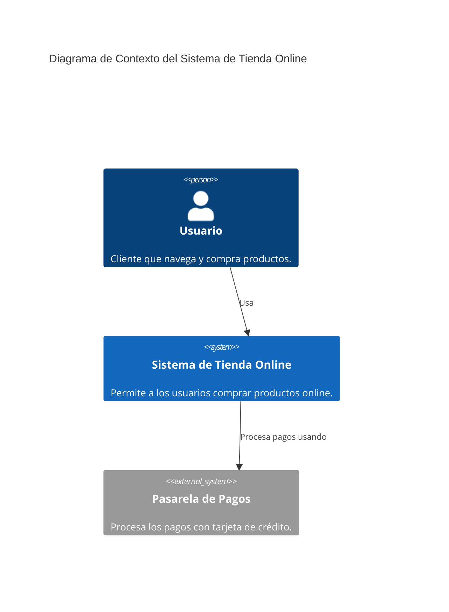
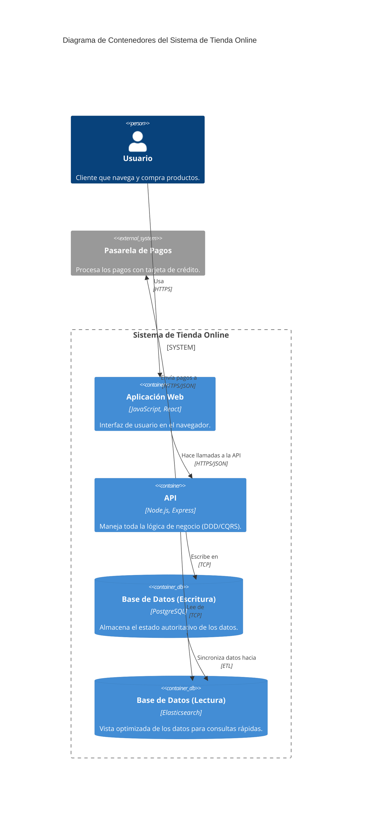
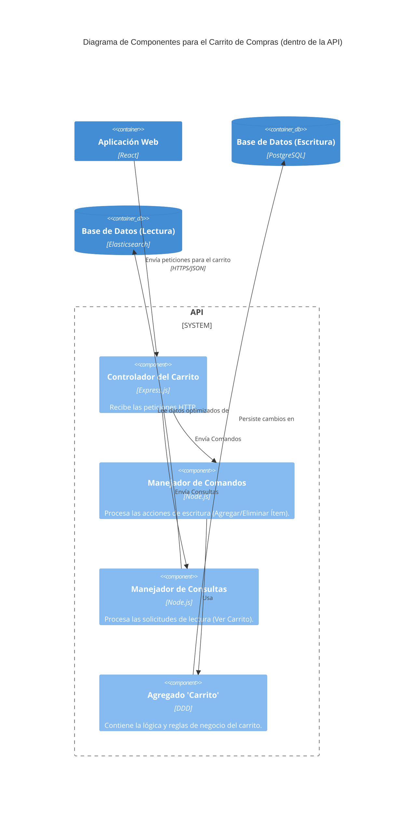
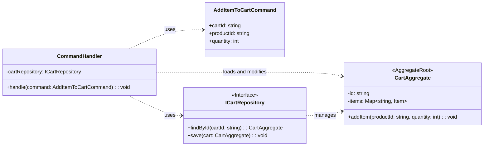

# Context

```mermaid
C4Context
  title Diagrama de Contexto del Sistema de Tienda Online

  Person(user, "Usuario", "Cliente que navega y compra productos.")
  System(ecommerce, "Sistema de Tienda Online", "Permite a los usuarios comprar productos online.")
  System_Ext(payment_gateway, "Pasarela de Pagos", "Procesa los pagos con tarjeta de crédito.")

  Rel(user, ecommerce, "Usa")
  Rel(ecommerce, payment_gateway, "Procesa pagos usando")
```

# Containers

```mermaid
C4Container
  title Diagrama de Contenedores del Sistema de Tienda Online

  Person(user, "Usuario", "Cliente que navega y compra productos.")
  System_Ext(payment_gateway, "Pasarela de Pagos", "Procesa los pagos con tarjeta de crédito.")

  System_Boundary(c1, "Sistema de Tienda Online") {
    Container(web_app, "Aplicación Web", "JavaScript, React", "Interfaz de usuario en el navegador.")
    Container(api, "API", "Node.js, Express", "Maneja toda la lógica de negocio (DDD/CQRS).")
    ContainerDb(write_db, "Base de Datos (Escritura)", "PostgreSQL", "Almacena el estado autoritativo de los datos.")
    ContainerDb(read_db, "Base de Datos (Lectura)", "Elasticsearch", "Vista optimizada de los datos para consultas rápidas.")
  }

  Rel(user, web_app, "Usa", "HTTPS")
  Rel(web_app, api, "Hace llamadas a la API", "HTTPS/JSON")
  
  Rel(api, write_db, "Escribe en", "TCP")
  Rel(api, read_db, "Lee de", "TCP")
  Rel(api, payment_gateway, "Envía pagos a", "HTTPS/JSON")
  
  Rel(write_db, read_db, "Sincroniza datos hacia", "ETL")
```

# Components 

```mermaid
C4Component
  title Diagrama de Componentes para el Carrito de Compras (dentro de la API)

  Container(web_app, "Aplicación Web", "React")
  ContainerDb(write_db, "Base de Datos (Escritura)", "PostgreSQL")
  ContainerDb(read_db, "Base de Datos (Lectura)", "Elasticsearch")

  System_Boundary(api, "API") {
    Component(cart_controller, "Controlador del Carrito", "Express.js", "Recibe las peticiones HTTP.")
    Component(command_handler, "Manejador de Comandos", "Node.js", "Procesa las acciones de escritura (Agregar/Eliminar Ítem).")
    Component(query_handler, "Manejador de Consultas", "Node.js", "Procesa las solicitudes de lectura (Ver Carrito).")
    
    Component(cart_aggregate, "Agregado 'Carrito'", "DDD", "Contiene la lógica y reglas de negocio del carrito.")
  }

  Rel(web_app, cart_controller, "Envía peticiones para el carrito", "HTTPS/JSON")
  
  Rel(cart_controller, command_handler, "Envía Comandos")
  Rel(cart_controller, query_handler, "Envía Consultas")

  Rel(command_handler, cart_aggregate, "Usa")
  Rel(cart_aggregate, write_db, "Persiste cambios en")
  
  Rel(query_handler, read_db, "Lee datos optimizados de")
```

# Code

```mermaid
classDiagram
  direction LR

  class CommandHandler {
    -cartRepository: ICartRepository
    +handle(command: AddItemToCartCommand): void
  }

  class AddItemToCartCommand {
    +cartId: string
    +productId: string
    +quantity: int
  }

  class ICartRepository {
    <<Interface>>
    +findById(cartId: string): CartAggregate
    +save(cart: CartAggregate): void
  }

  class CartAggregate {
    <<AggregateRoot>>
    -id: string
    -items: Map~string, Item~
    +addItem(productId: string, quantity: int): void
  }

  CommandHandler ..> AddItemToCartCommand : uses
  CommandHandler ..> ICartRepository : uses
  CommandHandler ..> CartAggregate : loads and modifies
  ICartRepository ..> CartAggregate : manages
```